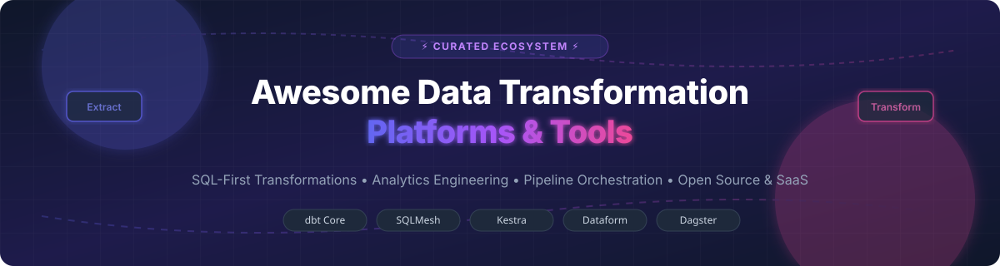

  

# 🚀 Awesome Data Transformation Platform

  
  
  
  
  

---

## 💡 Overview & Ecosystem

Welcome to the **Awesome Data Transformation Platform** curated directory! This repository tracks top-tier **SaaS platforms** and **open-source frameworks** designed for **Data Transformation**, **SQL-First ELT Pipelines**, **Analytics Engineering**, **Data Modeling**, and **Modern Workflow Orchestration**.

These solutions empower data engineers, analytics engineers, and data teams to build modular, testable, version-controlled, and production-grade data transformation pipelines.

---

## 📑 Table of Contents

- [☁️ SaaS / Hosted Platforms](#-saas--hosted-platforms)
- [🔓 Open-Source GitHub Projects](#-open-source-github-projects)
- [🤝 How to Contribute](#-how-to-contribute)
- [💖 Support & Sponsorship](#-support--sponsorship)
- [📈 Star History](#-star-history)
- [⚠️ Disclaimer](#%EF%B8%8F-disclaimer)

---

## ☁️ SaaS / Hosted Platforms

> 📊 **Market Size & Structure**: The Global Data Integration & Data Transformation market size is estimated at **~$15.8 Billion in 2025/2026** and projected to reach **~$34 Billion by 2030** (CAGR ~16.5%). The market is **moderately fragmented**, featuring established cloud giants alongside high-growth specialized vendors competing across visual ETL, AI-native transformation, and managed cloud IDEs.

Below is a curated comparison of leading enterprise SaaS and hosted transformation platforms, sorted by **Valuation / Company Size (Descending)**:

| Platform | Starting Price | Free Tier / Trial Limit | Size / Valuation / Revenue | Description |
| :--- | :--- | :--- | :--- | :--- |
| **[Google Dataform](https://cloud.google.com/dataform)** | $0.00 / slot-min (Included with BigQuery compute pricing) | Free unlimited compilation & development environment; pay only for underlying BigQuery execution query slots | **$2.1+ Trillion** (Parent Alphabet market cap) | BigQuery-native SQLX & JS templating transformation service integrated directly into Google Cloud Platform. |
| **[dbt Cloud](https://www.getdbt.com/)** | $84 / developer seat / month (Developer Tier) | Free Developer Plan (1 developer seat, 3,000 successful model run minutes/month forever) | **$4.2 Billion** (Valuation, Series D) | De facto standard managed environment for dbt pipelines with cloud IDE, scheduling, semantic layer, and CI/CD. |
| **[Matillion Data Productivity Cloud](https://www.matillion.com/)** | $2.00 / credit (~$500/mo team entry) | Free Plan (500 free credits/month forever) + 14-day full enterprise trial | **$1.5+ Billion** (Valuation, Unicorn status) | Enterprise ELT and cloud transformation platform featuring Maia AI Copilot, low-code/no-code visual workflows, and dbt support. |
| **[Coalesce](https://coalesce.io/)** | $1,000 / month (Standard tier) | 30-day Free Trial (Full feature access with sample data warehouse connection) | **$250+ Million** (Series B total funding $81M+) | Column-level lineage and metadata-driven transformation platform built natively for Snowflake and cloud data warehouses. |
| **[Prophecy](https://www.prophecy.ai/)** | $500 / month (Team Plan) | 14-day Free Trial (Full visual pipeline generator & AI copilot access) | **$150+ Million** (Series B total funding $67M+) | Enterprise low-code & AI-native data engineering platform generating visual, dbt, and PySpark data pipelines. |
| **[Upsolver](https://www.upsolver.com/)** | $0.10 / credit (Pay-as-you-go) | Free Tier ($300 free cloud credits valid for 30 days) | **$100+ Million** (Series B total funding $42M+) | Continuous data transformation and ingestion platform for streaming data and Apache Iceberg lakehouses. |
| **[WhereScape RED](https://www.wherescape.com/)** | $10,000 / year (Enterprise deployment quote) | 14-day Free Trial / Guided enterprise demo sandbox | **$50+ Million** (Acquired by Idera Software) | Automated data warehouse and ELT transformation suite for enterprise architectures. |
| **[DataOps.live](https://www.dataops.live/)** | $1,500 / month (Starter edition) | 30-day Free Trial (Full Momentum DataOps platform access) | **$50+ Million** (Series A total funding $37.5M) | DataOps orchestration and transformation management built for Snowflake data product lifecycle delivery. |
| **[Kestra Cloud](https://kestra.io/)** | $299 / month (Team Edition) | 14-day Free Cloud Trial (Unlimited workflow runs during trial) | **$20+ Million** (Seed/Series A total funding $11M+) | Fully managed cloud orchestration for language-agnostic, event-driven data and transformation workflows. |
| **[Rivery](https://rivery.io/)** | $0.75 / RCU (Starter Plan ~$100/mo) | 14-day Free Trial (includes 1,000 free pipeline credits) | **$20+ Million** (Series B total funding $48M+) | SaaS ELT platform offering data ingestion, Python/SQL transformations, and orchestration in a single interface. |
| **[Y42](https://www.y42.com/)** | $499 / month (Growth Plan) | 14-day Free Trial (Full data environment sandbox) | **$15+ Million** (Series A total funding $34M) | Asset-based data orchestration platform integrating dbt Core, Airbyte, Fivetran, and Python scripts into a unified DAG. |
| **[Altimate AI](https://www.altimate.ai/)** | $18 / developer / month | Free Forever Plan (Up to 2 developers with core dbt IDE & lineage features) | **$5+ Million** (Early stage venture-backed) | AI-powered analytics engineering suite & VS Code extension for dbt model development and optimization. |

---

## 🔓 Open-Source GitHub Projects

Below is a list of top open-source projects for SQL transformation, data pipeline orchestration, and ELT integration, sorted by **GitHub Stars (Descending)**:

| Project | Stars | License | Primary Category | Description |
| :--- | :--- | :--- | :--- | :--- |
| **[Apache Airflow](https://github.com/apache/airflow)** |  | Apache-2.0 | Orchestration | De facto open-source workflow management platform to programmatically author, schedule, and monitor data transformation pipelines. |
| **[Airbyte](https://github.com/airbytehq/airbyte)** |  | ELv2 / MIT | Data Integration & ELT | Leading open-source data integration engine with 350+ pre-built connectors to extract and load data prior to warehouse transformation. |
| **[dbt Core](https://github.com/dbt-labs/dbt-core)** |  | Apache-2.0 | SQL Transformation | **The industry standard for SQL-based transformations.** Enables analysts to write modular SELECT statements, version control, test, and document models. |
| **[Dagster](https://github.com/dagster-io/dagster)** |  | Apache-2.0 | Data Orchestrator | Asset-centric data orchestrator designed for development, testing, and monitoring of data assets and dbt pipelines. |
| **[Kestra](https://github.com/kestra-io/kestra)** |  | Apache-2.0 | Declarative Orchestration | Event-driven, declarative YAML workflow orchestration engine supporting SQL, Python, Node.js, Docker, and microservices. |
| **[Prefect](https://github.com/PrefectHQ/prefect)** |  | Apache-2.0 | Python Orchestration | Modern workflow coordination engine empowering data engineers to transform Python functions into resilient, monitored pipelines. |
| **[Meltano](https://github.com/meltano/meltano)** |  | MIT | Declarative ELT Engine | CLI-first, code-driven data integration and transformation framework built around Singer taps/targets and dbt models. |
| **[SQLMesh](https://github.com/SQLMesh/sqlmesh)** |  | Apache-2.0 | SQL Transformation | Next-generation transformation framework featuring virtual data environments, column-level lineage, multi-dialect transpilation, and ~9x execution speedups over traditional CLI engines. |
| **[Dataform Core](https://github.com/dataform-co/dataform)** |  | Apache-2.0 | BigQuery SQLX Framework | Open-source meta-language framework for compiling SQLX files and JavaScript templates into BigQuery data warehouse pipelines. |
| **[dbt-coves](https://github.com/datacoves/dbt-coves)** |  | Apache-2.0 | dbt Helper CLI | CLI tool to automate dbt model scaffolding, Airflow DAG generation, source generation, and dbt environment setup. |

---

## 🛠️ Open-Source Ecosystem Categories & Blueprints

- **SQL Transformation Frameworks**: **dbt Core** (de facto analytics engineering standard), **SQLMesh** (Linux Foundation governed, zero-copy virtual environments, column lineage), **Dataform Core** (BigQuery SQLX compilation).
- **Data Orchestration Platforms**: **Apache Airflow** (industry workhorse), **Dagster** (asset-based), **Kestra** (declarative YAML), **Prefect** (Python-native flow control).
- **Data Integration & ELT**: **Airbyte** (350+ connectors), **Meltano** (Singer & dbt code-first integration), **dbt-coves** (automation CLI).

> 💡 **Recommended Architecture**: Combine **dbt Core** or **SQLMesh** for warehouse transformation, **Airbyte** or **Meltano** for ingestion, and **Kestra** or **Dagster** for workflow orchestration.

---

## 🤝 How to Contribute

Contributions are warmly welcomed! Help keep this ecosystem list up-to-date and comprehensive.

1. Fork this repository.
2. Create a feature branch (`git checkout -b feature/new-platform`).
3. Add or update entries in `README.md` following the tabular format.
4. Open a Pull Request with a clear description of your additions.

---

## 💖 Support & Sponsorship

If you find this repository valuable for your analytics engineering work or data stack evaluation, please consider showing your support:

- 🌟 **Star this repository** on GitHub to help others discover it!
- 🔀 **Fork & Share** it with your data engineering team and community.
- ☕ **Buy me a coffee / Sponsor**: If you'd like to support the ongoing maintenance of this awesome list, visit the [GitHub Sponsor Dashboard](https://github.com/sponsors/ishandutta2007).

Thank you for being part of the open-source data community! ❤️

---

## 📈 Star History

---

## ⚠️ Disclaimer

- This list is **community-curated** for informational and educational purposes. Inclusion does not imply official endorsement.
- Data transformation platforms process critical enterprise data; ensure proper governance, data privacy compliance, and role-based security in production deployments.
- Commercial platforms provide managed infrastructure, AI assistants, and enterprise support SLA guarantees, whereas open-source alternatives offer complete code ownership and custom extensibility.
